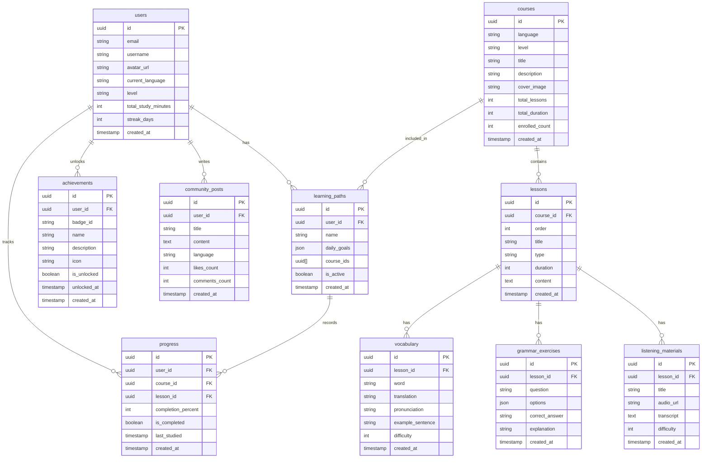

## 1. Architecture Design

```mermaid
graph TD
    subgraph Frontend
        A[React App]
        B[React Router]
        C[Tailwind CSS]
        D[Zustand]
        E[Supabase Client]
    end
    
    subgraph Backend
        F[Supabase Auth]
        G[Supabase Database]
        H[Supabase Storage]
    end
    
    A --&gt; B
    A --&gt; C
    A --&gt; D
    A --&gt; E
    E --&gt; F
    E --&gt; G
    E --&gt; H
```

## 2. Technology Description
- **Frontend**: React@18 + TypeScript + Vite
- **Initialization Tool**: vite-init with react-ts template
- **State Management**: Zustand
- **Styling**: Tailwind CSS
- **Routing**: React Router DOM
- **Icons**: Lucide React
- **Backend**: Supabase (Auth + Database + Storage)
- **Database**: PostgreSQL (Supabase managed)

## 3. Route Definitions
| Route | Purpose |
|-------|---------|
| / | 首页，展示课程推荐、学习统计 |
| /courses | 课程列表页，展示所有语言课程 |
| /courses/:id | 课程详情页，显示课程内容和进度 |
| /learn | 学习模块入口页 |
| /learn/vocabulary | 单词记忆模块 |
| /learn/grammar | 语法练习模块 |
| /learn/speaking | 口语跟读模块 |
| /learn/listening | 听力训练模块 |
| /progress | 学习进度追踪页 |
| /community | 社区交流页 |
| /profile | 用户中心页 |
| /login | 登录页 |
| /register | 注册页 |

## 4. API Definitions (None)
使用Supabase Client SDK直接进行数据操作，无需独立后端API层

## 5. Server Architecture Diagram (None)
不适用，使用Supabase作为后端服务

## 6. Data Model

### 6.1 Data Model Definition



### 6.2 Data Definition Language

```sql
-- 用户表
CREATE TABLE users (
    id UUID PRIMARY KEY REFERENCES auth.users(id) ON DELETE CASCADE,
    email TEXT UNIQUE NOT NULL,
    username TEXT,
    avatar_url TEXT,
    current_language TEXT DEFAULT 'en',
    level TEXT DEFAULT 'A1',
    total_study_minutes INTEGER DEFAULT 0,
    streak_days INTEGER DEFAULT 0,
    created_at TIMESTAMP WITH TIME ZONE DEFAULT NOW()
);

-- 课程表
CREATE TABLE courses (
    id UUID PRIMARY KEY DEFAULT gen_random_uuid(),
    language TEXT NOT NULL,
    level TEXT NOT NULL,
    title TEXT NOT NULL,
    description TEXT,
    cover_image TEXT,
    total_lessons INTEGER DEFAULT 0,
    total_duration INTEGER DEFAULT 0,
    enrolled_count INTEGER DEFAULT 0,
    created_at TIMESTAMP WITH TIME ZONE DEFAULT NOW()
);

-- 课程表
CREATE TABLE lessons (
    id UUID PRIMARY KEY DEFAULT gen_random_uuid(),
    course_id UUID REFERENCES courses(id) ON DELETE CASCADE,
    "order" INTEGER NOT NULL,
    title TEXT NOT NULL,
    type TEXT NOT NULL,
    duration INTEGER DEFAULT 0,
    content TEXT,
    created_at TIMESTAMP WITH TIME ZONE DEFAULT NOW()
);

-- 单词表
CREATE TABLE vocabulary (
    id UUID PRIMARY KEY DEFAULT gen_random_uuid(),
    lesson_id UUID REFERENCES lessons(id) ON DELETE CASCADE,
    word TEXT NOT NULL,
    translation TEXT,
    pronunciation TEXT,
    example_sentence TEXT,
    difficulty INTEGER DEFAULT 1,
    created_at TIMESTAMP WITH TIME ZONE DEFAULT NOW()
);

-- 语法练习表
CREATE TABLE grammar_exercises (
    id UUID PRIMARY KEY DEFAULT gen_random_uuid(),
    lesson_id UUID REFERENCES lessons(id) ON DELETE CASCADE,
    question TEXT NOT NULL,
    options JSONB,
    correct_answer TEXT NOT NULL,
    explanation TEXT,
    created_at TIMESTAMP WITH TIME ZONE DEFAULT NOW()
);

-- 听力材料表
CREATE TABLE listening_materials (
    id UUID PRIMARY KEY DEFAULT gen_random_uuid(),
    lesson_id UUID REFERENCES lessons(id) ON DELETE CASCADE,
    title TEXT NOT NULL,
    audio_url TEXT,
    transcript TEXT,
    difficulty INTEGER DEFAULT 1,
    created_at TIMESTAMP WITH TIME ZONE DEFAULT NOW()
);

-- 学习路径表
CREATE TABLE learning_paths (
    id UUID PRIMARY KEY DEFAULT gen_random_uuid(),
    user_id UUID REFERENCES users(id) ON DELETE CASCADE,
    name TEXT NOT NULL,
    daily_goals JSONB,
    course_ids UUID[],
    is_active BOOLEAN DEFAULT true,
    created_at TIMESTAMP WITH TIME ZONE DEFAULT NOW()
);

-- 学习进度表
CREATE TABLE progress (
    id UUID PRIMARY KEY DEFAULT gen_random_uuid(),
    user_id UUID REFERENCES users(id) ON DELETE CASCADE,
    course_id UUID REFERENCES courses(id),
    lesson_id UUID REFERENCES lessons(id),
    completion_percent INTEGER DEFAULT 0,
    is_completed BOOLEAN DEFAULT false,
    last_studied TIMESTAMP WITH TIME ZONE,
    created_at TIMESTAMP WITH TIME ZONE DEFAULT NOW()
);

-- 成就表
CREATE TABLE achievements (
    id UUID PRIMARY KEY DEFAULT gen_random_uuid(),
    user_id UUID REFERENCES users(id) ON DELETE CASCADE,
    badge_id TEXT NOT NULL,
    name TEXT NOT NULL,
    description TEXT,
    icon TEXT,
    is_unlocked BOOLEAN DEFAULT false,
    unlocked_at TIMESTAMP WITH TIME ZONE,
    created_at TIMESTAMP WITH TIME ZONE DEFAULT NOW()
);

-- 社区帖子表
CREATE TABLE community_posts (
    id UUID PRIMARY KEY DEFAULT gen_random_uuid(),
    user_id UUID REFERENCES users(id) ON DELETE CASCADE,
    title TEXT NOT NULL,
    content TEXT,
    language TEXT,
    likes_count INTEGER DEFAULT 0,
    comments_count INTEGER DEFAULT 0,
    created_at TIMESTAMP WITH TIME ZONE DEFAULT NOW()
);

-- 启用行级安全策略
ALTER TABLE users ENABLE ROW LEVEL SECURITY;
ALTER TABLE courses ENABLE ROW LEVEL SECURITY;
ALTER TABLE lessons ENABLE ROW LEVEL SECURITY;
ALTER TABLE vocabulary ENABLE ROW LEVEL SECURITY;
ALTER TABLE grammar_exercises ENABLE ROW LEVEL SECURITY;
ALTER TABLE listening_materials ENABLE ROW LEVEL SECURITY;
ALTER TABLE learning_paths ENABLE ROW LEVEL SECURITY;
ALTER TABLE progress ENABLE ROW LEVEL SECURITY;
ALTER TABLE achievements ENABLE ROW LEVEL SECURITY;
ALTER TABLE community_posts ENABLE ROW LEVEL SECURITY;

-- 用户表策略
CREATE POLICY "Users can view their own data" ON users
    FOR SELECT USING (auth.uid() = id);
CREATE POLICY "Users can update their own data" ON users
    FOR UPDATE USING (auth.uid() = id);

-- 课程表策略（公开可读）
CREATE POLICY "Courses are viewable by everyone" ON courses
    FOR SELECT USING (true);

-- 其他表策略
CREATE POLICY "Lessons are viewable by everyone" ON lessons
    FOR SELECT USING (true);
CREATE POLICY "Vocabulary is viewable by everyone" ON vocabulary
    FOR SELECT USING (true);
CREATE POLICY "Grammar exercises are viewable by everyone" ON grammar_exercises
    FOR SELECT USING (true);
CREATE POLICY "Listening materials are viewable by everyone" ON listening_materials
    FOR SELECT USING (true);

-- 用户特定数据策略
CREATE POLICY "Users can manage their own learning paths" ON learning_paths
    FOR ALL USING (auth.uid() = user_id);
CREATE POLICY "Users can manage their own progress" ON progress
    FOR ALL USING (auth.uid() = user_id);
CREATE POLICY "Users can manage their own achievements" ON achievements
    FOR ALL USING (auth.uid() = user_id);

-- 社区帖子策略
CREATE POLICY "Community posts are viewable by everyone" ON community_posts
    FOR SELECT USING (true);
CREATE POLICY "Users can create their own posts" ON community_posts
    FOR INSERT WITH CHECK (auth.uid() = user_id);
CREATE POLICY "Users can update their own posts" ON community_posts
    FOR UPDATE USING (auth.uid() = user_id);
CREATE POLICY "Users can delete their own posts" ON community_posts
    FOR DELETE USING (auth.uid() = user_id);

-- 授予权限
GRANT SELECT ON courses TO anon;
GRANT SELECT ON lessons TO anon;
GRANT SELECT ON vocabulary TO anon;
GRANT SELECT ON grammar_exercises TO anon;
GRANT SELECT ON listening_materials TO anon;
GRANT SELECT ON community_posts TO anon;

GRANT ALL PRIVILEGES ON users TO authenticated;
GRANT ALL PRIVILEGES ON learning_paths TO authenticated;
GRANT ALL PRIVILEGES ON progress TO authenticated;
GRANT ALL PRIVILEGES ON achievements TO authenticated;
GRANT ALL PRIVILEGES ON community_posts TO authenticated;
```
