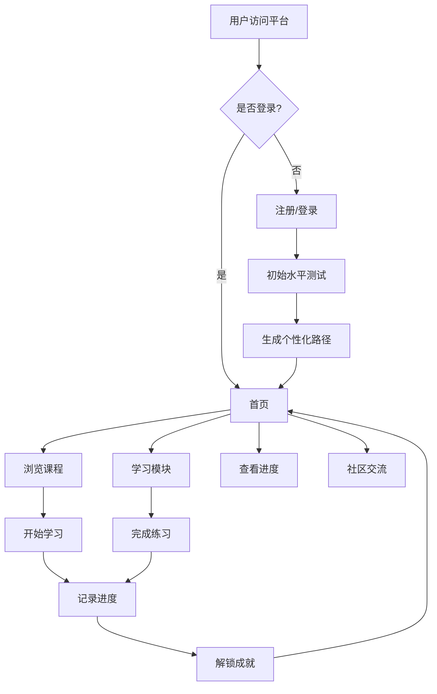

## 1. Product Overview
多语种在线学习平台，为用户提供英语、日语、韩语等主流语言的沉浸式学习体验。
- 解决传统语言学习枯燥低效的问题，通过互动学习和个性化路径提升学习效率
- 为全球语言学习者提供一站式学习解决方案

## 2. Core Features

### 2.1 User Roles
| Role | Registration Method | Core Permissions |
|------|---------------------|------------------|
| Normal User | Email/Google注册 | 浏览课程、学习模块、查看进度、参与社区、获取成就 |
| Premium User | 付费升级 | 解锁高级课程、专属练习、一对一辅导 |

### 2.2 Feature Module
1. **首页**: 课程推荐、学习统计、快速入口
2. **课程页面**: 分级课程体系、课程详情、课程进度
3. **学习模块**: 单词记忆、语法练习、口语跟读、听力训练
4. **进度追踪**: 学习日历、成就系统、数据可视化
5. **用户中心**: 个人资料、学习设置、社区交流
6. **登录注册**: 用户认证、个人信息管理

### 2.3 Page Details
| Page Name | Module Name | Feature description |
|-----------|-------------|---------------------|
| 首页 | Hero区域 | 多语言学习的沉浸式介绍、引导用户开始学习 |
| 首页 | 课程推荐 | 基于用户水平推荐合适课程、热门课程展示 |
| 首页 | 学习统计 | 今日学习时长、完成课程数、连续学习天数 |
| 课程页面 | 分级课程 | 按A1-C2级别划分的语言课程体系 |
| 课程页面 | 课程内容 | 视频讲解、练习材料、测试评估 |
| 学习模块 | 单词记忆 | 闪卡模式、拼写练习、单词测试 |
| 学习模块 | 语法练习 | 交互式语法题、错误反馈、规则讲解 |
| 学习模块 | 口语跟读 | 录音对比、发音评分、语调指导 |
| 学习模块 | 听力训练 | 原声听力材料、听写练习、理解测试 |
| 进度追踪 | 学习日历 | 每日学习记录、连续学习标记 |
| 进度追踪 | 成就系统 | 徽章奖励、等级系统、排行榜 |
| 用户中心 | 个人资料 | 头像上传、学习目标设置 |
| 用户中心 | 社区交流 | 语言交换、学习心得分享、问答论坛 |
| 登录注册 | 登录页面 | 邮箱/手机号登录、第三方登录 |
| 登录注册 | 注册页面 | 账号创建、初始水平测试、学习目标设定 |

## 3. Core Process
用户首次访问平台 → 注册登录 → 完成初始水平测试 → 获取个性化学习路径 → 开始课程学习 → 完成互动练习 → 查看学习进度 → 解锁成就 → 参与社区交流

## 4. User Interface Design
### 4.1 Design Style
- **主色调**: 蓝色(#3B82F6) - 代表知识与信任
- **辅助色**: 绿色(#10B981) - 代表进步与成长，紫色(#8B5CF6) - 代表创意与灵感
- **按钮风格**: 圆角矩形(8px)，带轻微阴影，悬停时有上浮效果
- **字体**: 使用Inter作为主要字体，Noto Sans SC/Noto Sans JP/Noto Sans KR支持多语言
- **布局风格**: 卡片式布局，清晰的信息层次
- **图标风格**: 使用Lucide图标库，简洁现代的线条风格

### 4.2 Page Design Overview
| Page Name | Module Name | UI Elements |
|-----------|-------------|-------------|
| 首页 | Hero区域 | 渐变背景、大标题、CTA按钮、多语言元素动画 |
| 首页 | 课程卡片 | 课程封面图片、级别标签、进度条、学习者数量 |
| 首页 | 学习统计 | 数据可视化卡片、图标、数字动画 |
| 课程页面 | 课程大纲 | 树形结构、已完成标记、视频时长 |
| 学习模块 | 单词闪卡 | 翻转动画、发音按钮、难度选择 |
| 学习模块 | 语法练习 | 交互表单、实时反馈、进度指示器 |
| 进度追踪 | 学习日历 | 日历视图、颜色标记、统计数据 |
| 用户中心 | 成就展示 | 徽章网格、解锁动画、成就描述 |

### 4.3 Responsiveness
- 采用桌面优先设计，同时适配平板和移动设备
- 响应式断点：sm(640px)、md(768px)、lg(1024px)、xl(1280px)
- 触摸优化：按钮最小尺寸48x48px，足够的点击区域
- 移动设备上采用垂直布局，简化导航

### 4.4 3D Scene Guidance (not applicable)
不适用3D场景
