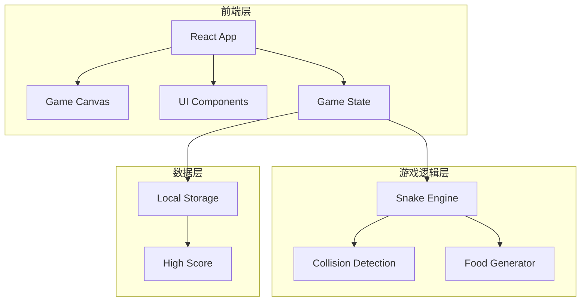

## 1. 架构设计



## 2. 技术说明

- **前端框架**：React@18 + TypeScript
- **样式方案**：Tailwind CSS@3
- **构建工具**：Vite
- **游戏渲染**：HTML5 Canvas
- **状态管理**：React useState + useReducer
- **数据存储**：LocalStorage（保存最高分）

## 3. 路由定义

| 路由 | 用途 |
|------|------|
| / | 游戏主页面 |

## 4. 组件架构

```
src/
├── components/
│   ├── GameCanvas.tsx      # 游戏画布组件
│   ├── ScoreBoard.tsx      # 分数面板组件
│   ├── ControlPanel.tsx    # 控制面板组件
│   └── GameOverModal.tsx   # 游戏结束弹窗组件
├── hooks/
│   ├── useGameLoop.ts      # 游戏循环Hook
│   └── useKeyboard.ts      # 键盘控制Hook
├── engine/
│   ├── Snake.ts            # 蛇逻辑
│   ├── Food.ts             # 食物逻辑
│   └── Game.ts             # 游戏主逻辑
├── types/
│   └── game.ts             # 类型定义
├── App.tsx                 # 主应用组件
└── main.tsx                # 入口文件
```

## 5. 游戏逻辑设计

### 5.1 核心类型定义

```typescript
interface Position {
  x: number;
  y: number;
}

interface GameState {
  snake: Position[];
  food: Position;
  direction: Direction;
  score: number;
  isGameOver: boolean;
  isPaused: boolean;
}

type Direction = 'UP' | 'DOWN' | 'LEFT' | 'RIGHT';
```

### 5.2 游戏参数

| 参数 | 值 | 说明 |
|------|-----|------|
| GRID_SIZE | 20 | 网格大小 |
| CELL_SIZE | 20px | 单元格像素大小 |
| INITIAL_SPEED | 150ms | 初始移动速度 |
| SPEED_INCREMENT | 10ms | 每吃一个食物速度提升 |

## 6. 性能优化

- 使用 requestAnimationFrame 进行游戏循环
- Canvas 双缓冲渲染
- 状态更新使用不可变数据
- 事件监听使用防抖处理
