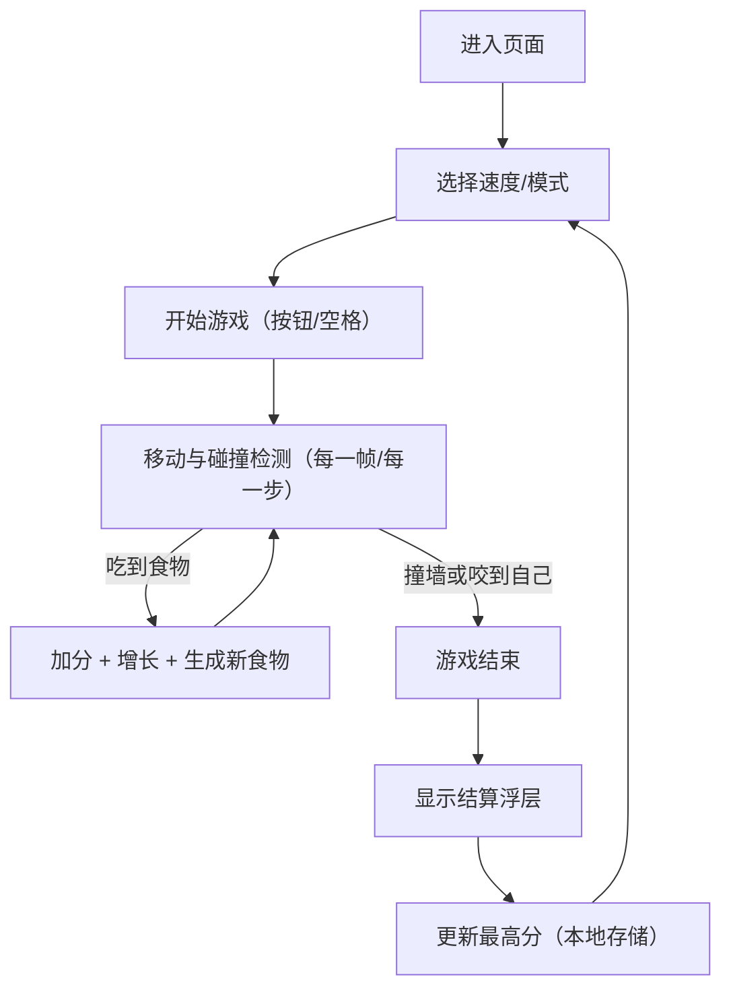

## 1. 产品概述
一个桌面优先的网页贪吃蛇小游戏：即开即玩、操作爽快、视觉风格强烈（复古霓虹 CRT），提供可调难度与本地最高分记录。
- 目标用户：想快速放松、打发碎片时间的用户；喜欢复古街机风格的玩家
- 价值：低学习成本 + 高复玩率（排行榜/难度/模式）+ 强辨识度视觉体验

## 2. 核心功能

### 2.1 用户角色
不区分角色（单机本地游戏）。

### 2.2 功能模块
1. **游戏界面**：棋盘渲染、蛇与食物显示、边界/穿墙模式
2. **控制与状态**：开始/暂停/重开、倒计时与状态提示、键盘与触屏（WASD/方向键）
3. **难度与模式**：速度档位、墙体开关、食物类型（普通/加分/减速）
4. **计分与记录**：实时分数、最高分（localStorage）、本局统计（长度、用时）
5. **声音与可访问性**：音效开关、减少动态效果选项、颜色对比与键盘可用

### 2.3 页面详情
| 页面名称 | 模块名称 | 功能描述 |
|---|---|---|
| 游戏页（单页） | 顶部信息栏 | 分数/最高分/速度/模式指示、状态提示（暂停/结束） |
| 游戏页（单页） | 主棋盘 | 网格渲染、蛇移动动画、食物生成与碰撞判定 |
| 游戏页（单页） | 控制面板 | 开始/暂停/重开、速度选择、穿墙/墙体开关、音效开关 |
| 游戏页（单页） | 结算浮层 | 结束原因、最终分数、用时、再来一局按钮 |

## 3. 核心流程
用户打开页面 → 选择速度/模式 → 点击开始或按空格 → 通过方向键移动 → 吃到食物加分并变长 → 撞墙/咬到自己结束 → 显示结算并写入最高分（若刷新记录）。

## 4. 用户界面设计

### 4.1 设计风格
- 视觉主题：复古街机 CRT（暗底 + 霓虹线框 + 扫描线/噪点层）
- 主色：深墨黑（背景）+ 霓虹青/紫（UI 与蛇高光）+ 荧光黄（食物强调）
- 按钮：硬边矩形 + 内阴影 + 发光描边；悬停有轻微“电流抖动”动效
- 字体：标题使用更具显示感的像素/街机风字体；正文使用可读性更好的无衬线
- 布局：上方信息栏 + 中央棋盘（固定比例）+ 右侧或下方控制面板（视宽度响应）
- 图标：极简线框（如音量、暂停）配合霓虹描边

### 4.2 页面设计概览
| 页面名称 | 模块名称 | UI 元素 |
|---|---|---|
| 游戏页（单页） | 背景氛围 | 渐变网格、噪点、扫描线、轻微漂移光晕 |
| 游戏页（单页） | 信息栏 | 分数数字用等宽/像素风，状态提示有高对比强调 |
| 游戏页（单页） | 棋盘 | 网格线细且低对比；蛇头更亮、身体有渐变尾迹；食物脉冲发光 |
| 游戏页（单页） | 控制面板 | 一组清晰的开关与选择器，键盘提示（↑↓←→/WASD/空格） |
| 游戏页（单页） | 结算浮层 | 半透明玻璃质感 + 霓虹描边，按钮强调“再来一局” |

### 4.3 响应式
- 桌面优先：棋盘保持稳定尺寸（或按视口等比缩放），右侧面板优先展示
- 移动端自适应：控制面板移至下方，提供触屏方向键（可折叠）
- 可访问性：支持仅键盘操作；提供“减少动效”选项；确保对比度达标

