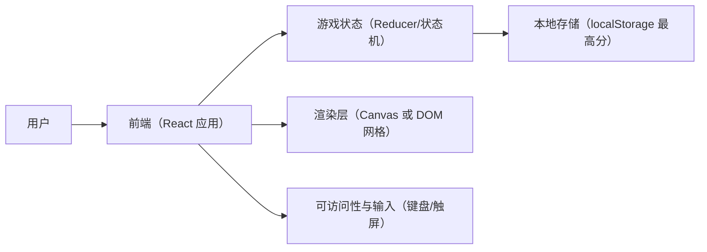
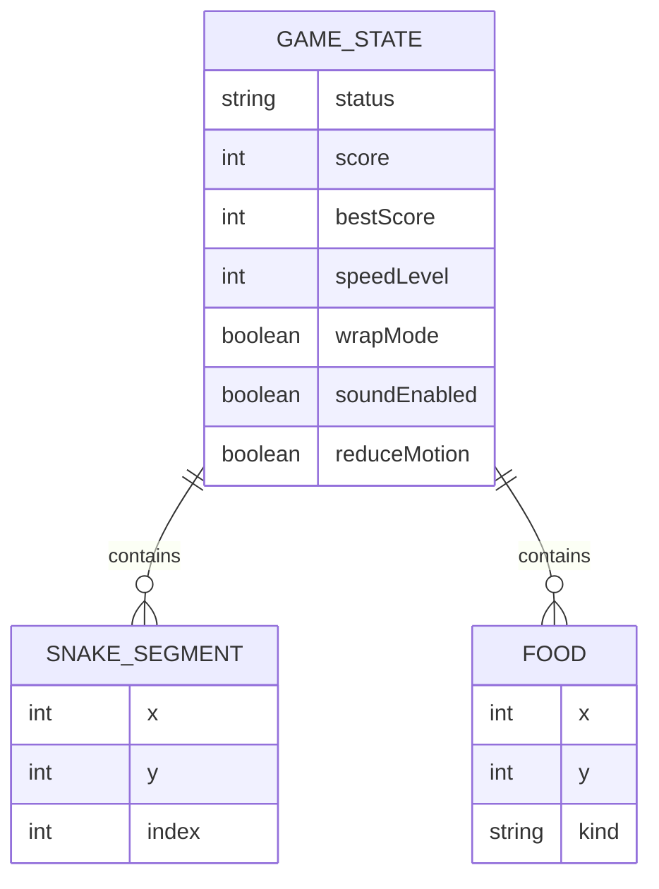

## 1. 架构设计

## 2. 技术说明
- 前端：React@18 + TypeScript + Vite
- 样式：tailwindcss@3（配合 CSS 变量与少量全局样式层做氛围特效）
- 状态管理：useReducer（单页面内）+ requestAnimationFrame/定时器驱动步进
- 数据持久化：localStorage（最高分、偏好设置：音效/动效/模式）
- 后端：无

## 3. 路由定义
| 路由 | 用途 |
|---|---|
| / | 贪吃蛇游戏单页（含配置、游戏、结算） |

## 4. API 定义
无（纯前端本地逻辑）。

## 5. 关键模块划分（前端）
- 游戏引擎：负责步进（tick）、输入缓冲、碰撞检测、食物生成、计分规则
- 渲染层：将状态映射到视觉（蛇、食物、网格、特效层）
- 输入层：键盘（方向键/WASD、空格暂停/开始、R 重开）与移动端触控按键
- 设置与存档：读写 localStorage、合并默认配置、版本兼容

## 6. 数据模型

### 6.1 数据模型定义

### 6.2 本地存储格式（示例）
- key：snake_best_score -> number
- key：snake_prefs -> { speedLevel, wrapMode, soundEnabled, reduceMotion }

